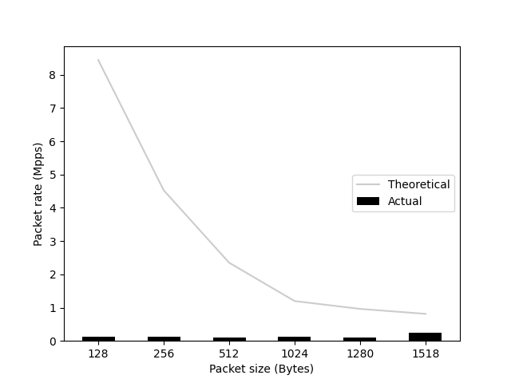
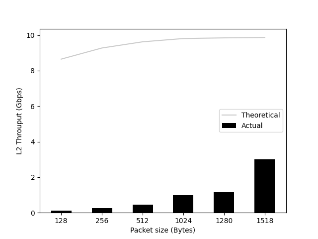

# autoiperf

A thin wrapper around `iperf -c` command.
It can also output and get the following figures:

  Packet rate (Mpps)       |  L2 Throughput (Gbps)       |  L1 Throughput (Gbps)
:-------------------------:|:---------------------------:|:---------------------------:
         |         |  

## Usage

```bash
# On server side:
iperf -s

# On client side:
python -m autoiperf.main
```

## Theoretical values

### Short Packet

| Layer | Size (Bytes) | Content                                                                 |
|-------|--------------|-------------------------------------------------------------------------|
| L1    | 84           | Preamble(7)/SFD(1)/ETH(14)/IPv4(20)/TCP(20)/L4Payload(6)/FCS(4)/IGP(12) |
| L2    | 64           | ETH(14)/IPv4(20)/TCP(20)/L4Payload(6)/FCS(4)                            |
| L3    | 46           | IPv4(20)/TCP(20)/L4Payload(6)                                           |

| Line Speed (Gbps) | Packet Rate (Mpps) | L2 throughput (Gbps) | L1 throughput (Gbps) |
|-------------------|--------------------|----------------------|----------------------|
| 1                 | 1.488095238        | 0.761904761          | 1                    |
| 10                | 14.88095238        | 7.619047619          | 10                   |
| 25                | 37.20238095        | 19.04761905          | 25                   |
| 40                | 59.52380952        | 30.47619048          | 40                   |
| 100               | 148.8095238        | 76.19047619          | 100                  |
| 400               | 595.2380952        | 304.7619048          | 400                  |

### Long Packet

| Layer | Size (Bytes) | Content                                                                    |
|-------|--------------|----------------------------------------------------------------------------|
| L1    | 1538         | Preamble(7)/SFD(1)/ETH(14)/IPv4(20)/TCP(20)/L4Payload(1460)/FCS(4)/IGP(12) |
| L2    | 1518         | ETH(14)/IPv4(20)/TCP(20)/L4Payload(1460)/FCS(4)                            |
| L3    | 1500         | IPv4(20)/TCP(20)/L4Payload(1460)                                           |

| Line Speed (Gbps) | Packet Rate (Mpps) | L2 throughput (Gbps) | L1 throughput (Gbps) |
|-------------------|--------------------|----------------------|----------------------|
| 1                 | 0.081274382        | 0.986996098          | 1                    |
| 10                | 0.812743823        | 9.869960988          | 10                   |
| 25                | 2.031859558        | 24.67490247          | 25                   |
| 40                | 3.250975293        | 39.47984395          | 40                   |
| 100               | 8.127438231        | 98.69960988          | 100                  |
| 400               | 32.50975293        | 394.7984395          | 400                  |
